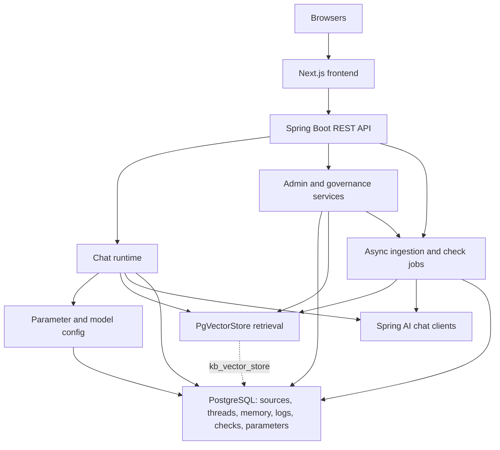

<!-- generated-by: gsd-doc-writer -->
# Architecture

## System Overview

`traffic-law-chatbot` is a full-stack Vietnamese traffic-law assistant built as a browser frontend over a modular Spring Boot backend. Its primary inputs are user questions plus administrator-managed file and URL sources; its primary outputs are citation-backed chat answers, source and index governance state, chat audit logs, and model-evaluated check-run results. Architecturally, the system is a Next.js 16 App Router client backed by a layered Spring Boot 4 monolith that uses PostgreSQL, `kb_vector_store` in pgvector, and asynchronous workers for ingestion and evaluation.

## Component Diagram



## Data Flow

### Frontend Request Flow

1. `frontend/app/layout.tsx` wraps all routes with `Providers`, `SidebarProvider`, `AppSidebar`, and `ErrorBoundary`, while route groups under `frontend/app/(chat)` and `frontend/app/(admin)` split user chat from operator workflows.
2. Client pages call React Query hooks from `frontend/hooks/*.ts`, and those hooks use the axios helpers in `frontend/lib/api/*.ts` against `/api/v1/chat`, `/api/v1/admin/sources`, `/api/v1/admin/chunks`, `/api/v1/admin/parameter-sets`, `/api/v1/admin/trust-policies`, `/api/v1/admin/chat-logs`, `/api/v1/admin/check-defs`, `/api/v1/admin/check-runs`, and `/api/v1/admin/allowed-models`.
3. Successful mutations invalidate query keys so the thread list, source tables, chunk dashboards, trust-policy editor, parameter-set screens, chat-log views, and check-run pages refresh from backend state instead of duplicating business logic in the browser.

### Ingestion And Governance Flow

1. `IngestionAdminController` accepts uploads, single URL imports, and batch URL imports; `IngestionService` validates input, performs duplicate-URL and SSRF checks, stores upload temp files when needed, and creates `KbSource`, `KbSourceVersion`, and `KbIngestionJob` records.
2. After the transaction commits, `IngestionOrchestrator.runPipeline(...)` executes asynchronously on `ingestionExecutor`; URL jobs fetch content through `SafeUrlFetcher` and parse with `UrlPageParser`, while file and reingest jobs resolve a parser through `FileIngestionParserResolver`.
3. `TokenChunkingService` turns the parsed document into `ChunkResult` records, and the orchestrator writes them into `kb_vector_store` through Spring AI `VectorStore` with source metadata plus hardcoded `trusted=false` and `active=false`.
4. `SourceService.approve(...)`, `reject(...)`, `activate(...)`, `deactivate(...)`, and `reingest(...)` update relational source state and call `ChunkMetadataUpdater` so the vector-store metadata stays aligned with approval and activation gates.
5. `ChunkInspectionService` reads `kb_vector_store` directly with `JdbcTemplate` for readiness counts, index summary, and per-chunk detail. `SourceTrustPolicyService` manages trust-policy records separately and, by design, does not mutate `ApprovalState`, `TrustedState`, or `SourceStatus` on `KbSource`.

### Chat Request Flow

1. `PublicChatController` exposes the one-shot `POST /api/v1/chat` endpoint plus threaded `/threads` endpoints. One-shot requests call `ChatService` directly, while threaded requests flow through `ChatThreadService`, which persists `ChatThread` and `ChatMessage` rows before and after each answer.
2. `ChatService` builds a `SearchRequest` through `RetrievalPolicy`, queries the PgVector store, maps the hits into citations and source references, and refuses the answer when no approved, trusted, active legal material or no legal citation signal is found.
3. For grounded requests, `ChatPromptFactory` and `AnswerCompositionPolicy` read runtime YAML from `ActiveParameterSetProvider`; `ChatClientConfig` resolves a `ChatClient` from the `app.ai.models` catalog; and `MessageChatMemoryAdvisor` attaches JDBC-backed `ChatMemory` when a conversation ID is present.
4. The model payload is parsed into `LegalAnswerDraft`, then `AnswerComposer`, `ScenarioAnswerComposer`, and `ChatThreadMapper` build the final `ChatAnswerResponse` with answer sections, citations, source references, and optional scenario analysis.
5. `ChatLogService` persists the question, answer, grounding status, token usage, latency, and pipeline log so the admin chat-log pages can audit both the user-visible answer and the retrieval/model path behind it.

### Check Run Flow

1. Admin check screens create and edit `CheckDef` records through `CheckDefAdminController`, then trigger evaluation runs through `CheckRunAdminController`.
2. `CheckRunService` snapshots the current active parameter-set metadata into a `CheckRun` row and schedules `CheckRunner.runAll(...)` after commit on the shared async executor.
3. `CheckRunner` replays every active definition through `ChatService` and scores the returned answer with `LlmSemanticEvaluator`, which reuses the same `chatClientMap` and falls back to evaluator model settings from the active parameter set or `app.ai.evaluator-model`.
4. The resulting `CheckResult` rows and aggregate run status are stored in PostgreSQL and exposed back to the admin UI for review.

## Key Abstractions

| Abstraction | Purpose | Location |
| --- | --- | --- |
| `ChatService` | Central chat runtime for retrieval, grounding checks, prompt building, model invocation, draft parsing, answer composition, and chat-log persistence. | `src/main/java/com/vn/traffic/chatbot/chat/service/ChatService.java` |
| `ChatThreadService` | Persists thread and message state and wraps chat responses with thread-specific scenario context. | `src/main/java/com/vn/traffic/chatbot/chat/service/ChatThreadService.java` |
| `RetrievalPolicy` | Owns the safety-critical PgVector filter and the active similarity-threshold and top-k policy. | `src/main/java/com/vn/traffic/chatbot/retrieval/RetrievalPolicy.java` |
| `ActiveParameterSetProvider` | Reads the active YAML parameter set from PostgreSQL and exposes typed runtime values to chat and evaluation policies. | `src/main/java/com/vn/traffic/chatbot/parameter/service/ActiveParameterSetProvider.java` |
| `ChatClientConfig` | Builds the immutable `Map<String, ChatClient>` from `app.ai.models` and the configured base URL used by the chat runtime. | `src/main/java/com/vn/traffic/chatbot/chat/config/ChatClientConfig.java` |
| `IngestionService` | Transactional entry point for upload, URL import, and ingestion job retry or cancel flows. | `src/main/java/com/vn/traffic/chatbot/ingestion/service/IngestionService.java` |
| `IngestionOrchestrator` | Async pipeline executor that fetches, parses, chunks, embeds, indexes, and finalizes source ingestion jobs. | `src/main/java/com/vn/traffic/chatbot/ingestion/orchestrator/IngestionOrchestrator.java` |
| `SourceService` | Governs source approval, activation, deactivation, and reingestion while mirroring those transitions into vector metadata. | `src/main/java/com/vn/traffic/chatbot/source/service/SourceService.java` |
| `ChunkInspectionService` | Reads `kb_vector_store` directly with `JdbcTemplate` to power readiness, summary, and chunk-detail admin views. | `src/main/java/com/vn/traffic/chatbot/chunk/service/ChunkInspectionService.java` |
| `CheckRunner` | Async evaluator that replays active check definitions through the chat system and stores scored quality-check results. | `src/main/java/com/vn/traffic/chatbot/checks/service/CheckRunner.java` |

## Directory Structure Rationale

The repository is organized as a split frontend plus modular backend: `frontend/` contains the App Router UI and browser-only integration code, while `src/main/java/com/vn/traffic/chatbot` groups backend code by domain slice so chat, ingestion, governance, audit, and evaluation can evolve independently inside one deployable application.

```text
frontend/
  app/                            App Router entrypoints for chat and admin route groups
  components/                     admin, chat, layout, ai-elements, and shared UI building blocks
  hooks/                          React Query hooks that bind pages to backend resources
  lib/                            axios clients, query keys, and frontend utilities
  types/                          shared API response and request types for the UI
src/
  main/
    java/com/vn/traffic/chatbot/
      chat/                        public Q&A, thread persistence, prompt building, and answer composition
      chatlog/                     persisted chat audit logs and admin filtering
      checks/                      quality-check definitions, async runs, and semantic evaluation
      chunk/                       vector-table inspection and metadata update helpers
      common/                      shared API envelopes, configuration, errors, logging, and AOP
      ingestion/                   upload and URL intake, fetch, parser resolution, chunking, and orchestration
      parameter/                   parameter-set CRUD, activation, seeding, and runtime lookup
      retrieval/                   centralized retrieval filter and search policy
      source/                      source registry, approval workflow, trust-policy CRUD, and lifecycle state
    resources/
      application.yaml            runtime application configuration
      default-parameter-set.yml   seeded YAML for the first active parameter set
      db/changelog/               Liquibase schema history
  test/
    java/                         package-aligned controller, service, parser, and integration tests
docs/                             generated project documentation
gradle/                           Gradle wrapper support files
scripts/import_sources/           repository-local traffic-law source corpus files
screenshots/                      captured UI flows for manual verification and docs
```

- `frontend/` stays separate from `src/main/java` so App Router pages, React Query caching, and client-side UI composition do not leak into the Spring service layer.
- `chat/`, `chatlog/`, and `checks/` are separate slices because answer generation, runtime audit logs, and offline quality evaluation share data but have different persistence and async lifecycles.
- `ingestion/`, `source/`, and `chunk/` divide responsibilities cleanly: queueing and parsing live in `ingestion/`, governance transitions live in `source/`, and direct `kb_vector_store` inspection or metadata mutation lives in `chunk/`.
- `parameter/` and `retrieval/` keep runtime knobs and the safety-critical retrieval gate centralized instead of scattering thresholds, messages, or filter expressions across services.
- `common/` contains cross-cutting infrastructure such as config binding, async execution, error handling, CORS, response envelopes, and logging so the domain slices remain focused.
- `src/main/resources/db/changelog/` mirrors the live persistence model: source and ingestion state, vector-store schema, chat threads and JDBC chat memory, chat logs, trust policies, check runs, and AI parameter sets.
