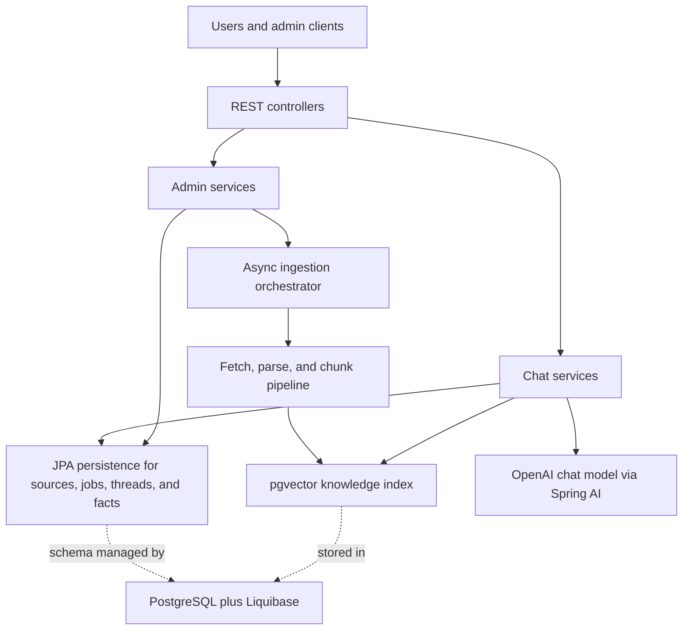

<!-- generated-by: gsd-doc-writer -->
# Architecture

## System Overview

`traffic-law-chatbot` is a layered Spring Boot 4 monolith that ingests Vietnamese traffic-law documents and web pages into a PostgreSQL-backed pgvector knowledge base, then serves retrieval-grounded chat responses through REST APIs with source approval gates, async ingestion jobs, and per-thread fact memory for scenario analysis.

## Component Diagram



## Data Flow

### Ingestion And Activation Flow

1. Admin clients submit a file or URL to `IngestionAdminController`, which delegates to `IngestionService` to validate input, create a `KbSource`, create a `KbSourceVersion`, and enqueue a `KbIngestionJob`.
2. `IngestionService` schedules `IngestionOrchestrator.runPipeline(...)` after the surrounding transaction commits so the async worker only sees committed source and job records.
3. `IngestionOrchestrator` fetches remote HTML through `SafeUrlFetcher` or loads an uploaded file, then resolves the parser through `FileIngestionParserResolver` and produces a normalized `ParsedDocument`.
4. `TokenChunkingService` splits parsed sections into token-aware chunks, and the orchestrator writes them into the `kb_vector_store` table through Spring AI `VectorStore`.
5. Newly indexed chunks are deliberately written with `trusted=false` and `active=false`; `SourceService.approve(...)` and `SourceService.activate(...)` later update the vector-store metadata so only approved, trusted, active content becomes retrievable.

### Chat Request Flow

1. `PublicChatController` handles one-shot questions directly through `ChatService` and threaded conversations through `ChatThreadService`.
2. For threaded conversations, `ChatThreadService` stores the user message, asks `FactMemoryService` to extract structured facts from the message, and uses `ClarificationPolicy` to decide whether the system has enough case detail to answer.
3. If required facts are missing, the thread service returns a clarification response; if the clarification budget is exhausted or nothing retrievable is available, it returns a refusal response.
4. `ChatService` builds a `SearchRequest` with `RetrievalPolicy`, queries the vector store, maps results into citations and source references, and refuses to answer if the retrieved material is missing or does not look like legal authority.
5. When grounding is sufficient, `ChatPromptFactory` assembles a constrained JSON-only prompt, `ChatClient` sends it to the OpenAI-backed Spring AI chat model, and `AnswerComposer` plus `ChatThreadMapper` turn the model output into the final API response, optionally enriched with remembered facts and scenario analysis.

## Key Abstractions

| Abstraction | Purpose | Location |
| --- | --- | --- |
| `PublicChatController` | Exposes the public chat API for one-shot questions, thread creation, thread listing, and follow-up messages. | `src/main/java/com/vn/traffic/chatbot/chat/api/PublicChatController.java` |
| `ChatThreadService` | Persists thread state, appends chat messages, applies clarification rules, and injects thread context into chat responses. | `src/main/java/com/vn/traffic/chatbot/chat/service/ChatThreadService.java` |
| `ChatService` | Runs retrieval, grounding checks, prompt construction, model invocation, JSON parsing, and safe answer composition. | `src/main/java/com/vn/traffic/chatbot/chat/service/ChatService.java` |
| `FactMemoryService` | Extracts and versions structured facts such as vehicle type or violation type so later messages can reuse earlier context. | `src/main/java/com/vn/traffic/chatbot/chat/service/FactMemoryService.java` |
| `RetrievalPolicy` | Centralizes the vector-search threshold and the metadata filter that limits retrieval to approved, trusted, active chunks. | `src/main/java/com/vn/traffic/chatbot/retrieval/RetrievalPolicy.java` |
| `IngestionService` | Creates source/version/job records and is the transactional entry point for upload and URL ingestion. | `src/main/java/com/vn/traffic/chatbot/ingestion/service/IngestionService.java` |
| `IngestionOrchestrator` | Executes the async pipeline stages `FETCH -> PARSE -> CHUNK -> EMBED -> INDEX -> FINALIZE` for a queued ingestion job. | `src/main/java/com/vn/traffic/chatbot/ingestion/orchestrator/IngestionOrchestrator.java` |
| `DocumentParser` | Defines the parser SPI used by PDF, HTML, and Tika-backed implementations to normalize diverse source inputs into `ParsedDocument`. | `src/main/java/com/vn/traffic/chatbot/ingestion/parser/DocumentParser.java` |
| `SourceService` | Owns source approval and activation state and propagates those state changes into vector-store metadata. | `src/main/java/com/vn/traffic/chatbot/source/service/SourceService.java` |
| `ChunkInspectionService` | Reads `kb_vector_store` directly with `JdbcTemplate` to report chunk readiness, chunk details, and index summary metrics. | `src/main/java/com/vn/traffic/chatbot/chunk/service/ChunkInspectionService.java` |

`AiParameterSetService` in `src/main/java/com/vn/traffic/chatbot/parameter/service/AiParameterSetService.java` is a separate admin/config subsystem that stores and seeds parameter-set records. Based on the current `src/main/java` call graph, it is not yet wired into `ChatService` or `ChatPromptFactory` at runtime.

## Directory Structure Rationale

The code is organized as a domain-oriented monolith: each top-level package under `com.vn.traffic.chatbot` owns its API, service, domain, and repository code for one business area, while `common` holds cross-cutting infrastructure. This keeps ingestion, retrieval, chat, and source-governance concerns isolated without splitting the project into separate deployable services.

```text
src/
  main/
    java/com/vn/traffic/chatbot/
      chat/        public Q&A, thread memory, citations, prompt/answer composition
      chunk/       vector-index inspection and metadata updates
      common/      shared API paths, config, pagination, and exception handling
      ingestion/   async jobs, URL fetching, parsing, and chunk generation
      parameter/   AI parameter-set CRUD and default seeding
      retrieval/   shared retrieval filter and search policy
      source/      knowledge-source registry, approval workflow, and lifecycle changes
    resources/
      application.yaml            runtime and infrastructure configuration
      default-parameter-set.yml   seeded parameter-set content
      db/changelog/               Liquibase schema history
  test/
    java/                         package-aligned controller, service, parser, and integration tests
docs/                             generated project documentation
gradle/                           Gradle wrapper support files
```

- `chat/` is separate from `source/` and `ingestion/` because answering questions depends on already-approved indexed content, not on the mechanics of building that index.
- `ingestion/` owns the workflow-style pipeline because fetch/parse/chunk/index concerns are operationally different from the CRUD-heavy source-governance logic in `source/`.
- `chunk/` exists as its own slice because the vector table is queried and updated with `JdbcTemplate` rather than through JPA entities, so operational index visibility stays isolated from the relational domain model.
- `parameter/` is isolated so prompt or model-tuning artifacts can evolve independently of the live chat path; at present it behaves as an admin-managed datastore plus seed process.
- `src/main/resources/db/changelog/` mirrors the main persistence concerns: source registry and jobs, vector store schema, chat thread/fact state, and parameter-set storage.
