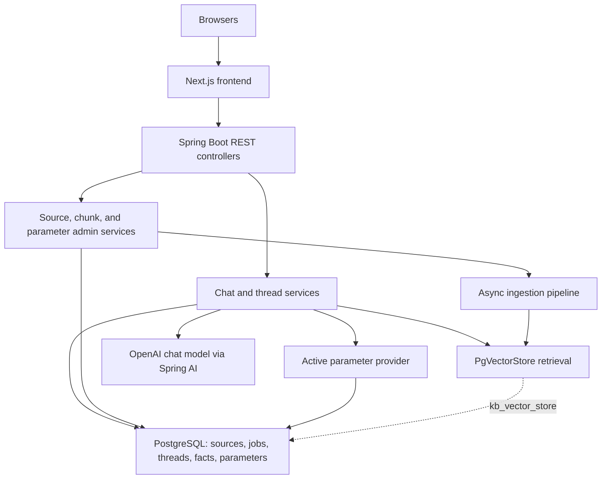

<!-- generated-by: gsd-doc-writer -->
# Architecture

## System Overview

`traffic-law-chatbot` is a two-tier system: a Next.js 16 frontend provides the chat and admin interfaces, while a layered Spring Boot 4 backend ingests Vietnamese traffic-law documents into PostgreSQL plus pgvector, enforces approval and activation gates, stores thread and fact memory, and returns retrieval-grounded chat responses using Spring AI with runtime-configurable parameter sets.

## Component Diagram



## Data Flow

### Frontend Request Flow

1. Route groups under `frontend/app/(chat)` and `frontend/app/(admin)` render end-user chat and operator workflows inside a shared shell defined by `RootLayout`, `Providers`, and `AppSidebar`.
2. Client components call React Query hooks from `frontend/hooks/*.ts`, which in turn use the axios helpers in `frontend/lib/api/*.ts` to talk to `/api/v1/chat` and `/api/v1/admin/...`.
3. Successful mutations invalidate cached queries so the sidebar thread list, source tables, index dashboards, and parameter-set screens refresh from the backend without duplicating business logic in the browser.

### Ingestion And Activation Flow

1. The admin UI or any direct client submits a file or URL to `IngestionAdminController`, which delegates to `IngestionService` to validate input, create a `KbSource`, create a `KbSourceVersion`, and enqueue a `KbIngestionJob`.
2. `IngestionService` schedules `IngestionOrchestrator.runPipeline(...)` after the surrounding transaction commits so the async worker only sees committed source and job records.
3. `IngestionOrchestrator` fetches remote HTML through `SafeUrlFetcher` or loads an uploaded file, then routes parsing through `UrlPageParser` or `FileIngestionParserResolver` and produces a normalized `ParsedDocument`.
4. `TokenChunkingService` splits parsed sections into token-aware chunks, and the orchestrator writes them into `kb_vector_store` through Spring AI `VectorStore` with `trusted=false`, `active=false`, and the current approval state embedded in metadata.
5. `SourceService.approve(...)`, `reject(...)`, `activate(...)`, `deactivate(...)`, and `reingest(...)` update relational source state and use `ChunkMetadataUpdater` to keep vector-store metadata aligned with governance state.
6. Admin index views call `ChunkInspectionService`, which queries `kb_vector_store` directly with `JdbcTemplate` to expose readiness counts, chunk detail, and index summary metrics.

### Chat Request Flow

1. One-shot questions hit `PublicChatController.answer(...)` directly, while threaded conversations flow through `createThread(...)` and `postMessage(...)`; the frontend chat pages consume those endpoints through `useCreateThread`, `usePostMessage`, and `useThreadMessages`.
2. `ChatThreadService` persists user and assistant messages, asks `FactMemoryService` to extract structured facts from each user message, and uses `ClarificationPolicy` to decide whether enough case detail exists to continue.
3. `ClarificationPolicy`, `RetrievalPolicy`, `ChatPromptFactory`, and `AnswerCompositionPolicy` all read runtime values from `ActiveParameterSetProvider`, which loads the active YAML parameter set from PostgreSQL and falls back to hardcoded defaults when needed.
4. If required facts are still missing, the thread service returns a clarification response; if the clarification budget is exhausted or retrieval has no usable authority, it returns a refusal response.
5. For answerable requests, `ChatService` builds a `SearchRequest`, queries the vector store with the hardcoded approved/trusted/active filter, maps results into citations and source references, and rejects answers that do not look sufficiently grounded in legal material.
6. When grounding is sufficient, `ChatClient` invokes the `openAiChatModel`; `AnswerComposer`, `ScenarioAnswerComposer`, and `ChatThreadMapper` convert the model draft into the final API response and optionally attach remembered facts plus scenario analysis.

## Key Abstractions

| Abstraction | Purpose | Location |
| --- | --- | --- |
| `use-chat.ts` | Frontend integration layer for thread creation, message posting, and message-history fetching through React Query. | `frontend/hooks/use-chat.ts` |
| `PublicChatController` | Exposes the public chat API for one-shot questions, thread creation, thread listing, and follow-up messages. | `src/main/java/com/vn/traffic/chatbot/chat/api/PublicChatController.java` |
| `ChatThreadService` | Persists thread state, appends chat messages, applies clarification rules, and injects thread context into chat responses. | `src/main/java/com/vn/traffic/chatbot/chat/service/ChatThreadService.java` |
| `ChatService` | Runs retrieval, grounding checks, prompt construction, model invocation, JSON parsing, and safe answer composition. | `src/main/java/com/vn/traffic/chatbot/chat/service/ChatService.java` |
| `RetrievalPolicy` | Centralizes the vector-search threshold and the metadata filter that limits retrieval to approved, trusted, active chunks. | `src/main/java/com/vn/traffic/chatbot/retrieval/RetrievalPolicy.java` |
| `ActiveParameterSetProvider` | Loads the active YAML parameter set from the database and supplies runtime knobs for retrieval, prompting, clarification, and answer messaging. | `src/main/java/com/vn/traffic/chatbot/parameter/service/ActiveParameterSetProvider.java` |
| `IngestionService` | Creates source/version/job records and is the transactional entry point for upload and URL ingestion. | `src/main/java/com/vn/traffic/chatbot/ingestion/service/IngestionService.java` |
| `IngestionOrchestrator` | Executes the async pipeline stages `FETCH -> PARSE -> CHUNK -> EMBED -> INDEX -> FINALIZE` for a queued ingestion job. | `src/main/java/com/vn/traffic/chatbot/ingestion/orchestrator/IngestionOrchestrator.java` |
| `SourceService` | Owns source approval and activation state and propagates those state changes into vector-store metadata. | `src/main/java/com/vn/traffic/chatbot/source/service/SourceService.java` |
| `ChunkInspectionService` | Reads `kb_vector_store` directly with `JdbcTemplate` to report chunk readiness, chunk details, and index summary metrics. | `src/main/java/com/vn/traffic/chatbot/chunk/service/ChunkInspectionService.java` |

## Directory Structure Rationale

The repository is organized as a two-application codebase: `frontend/` contains the browser UI, while `src/main/java` contains a domain-oriented Spring backend where each top-level package under `com.vn.traffic.chatbot` owns one business slice. That split keeps React and App Router concerns out of the Java service layer while still preserving a single backend deployable.

```text
frontend/
  app/                            App Router entrypoints for chat and admin areas
  components/                     reusable layout, chat, admin, and UI primitives
  hooks/                          React Query hooks for backend integration
  lib/api/                        axios clients for REST endpoints
src/
  main/
    java/com/vn/traffic/chatbot/
      chat/                        public Q&A, thread memory, clarification, and answer composition
      chunk/                       vector-index inspection and metadata updates
      common/                      shared API paths, config, pagination, and exception handling
      ingestion/                   async jobs, URL/file fetch, parsing, chunking, and indexing
      parameter/                   parameter-set CRUD, default seeding, and runtime provider
      retrieval/                   shared retrieval filter and search policy
      source/                      knowledge-source registry, approval workflow, and lifecycle changes
    resources/
      application.yaml            runtime and infrastructure configuration
      default-parameter-set.yml   seeded YAML parameter-set content
      db/changelog/               Liquibase schema history
  test/
    java/                         package-aligned controller, service, parser, and integration tests
docs/                             generated project documentation
gradle/                           Gradle wrapper support files
screenshots/                      captured UI flows for manual verification and docs
```

- `frontend/` is separate from `src/main/java` so the App Router UI, React Query cache, and shadcn-based components can evolve without leaking presentation concerns into the Spring domain model.
- `frontend/app/(chat)` and `frontend/app/(admin)` share one shell but keep end-user chat and operator workflows isolated at the route level.
- `chat/` depends on `retrieval/` and `parameter/` rather than on `source/` or `ingestion/` directly, so answer generation only works with already-indexed, policy-filtered material.
- `ingestion/` owns the asynchronous file and URL pipeline, while `source/` owns governance transitions that also propagate into vector metadata through `chunk/`.
- `chunk/` remains its own slice because inspection and metadata update operations hit `kb_vector_store` directly with `JdbcTemplate`, not through JPA entities.
- `parameter/` is a live runtime subsystem now: it stores admin-managed YAML, seeds a default record on startup, and feeds retrieval, prompt, clarification, and answer-composition policies.
- `src/main/resources/db/changelog/` mirrors the main persistence concerns: source and job tables, vector-store schema, chat thread and message state, and parameter-set storage.
